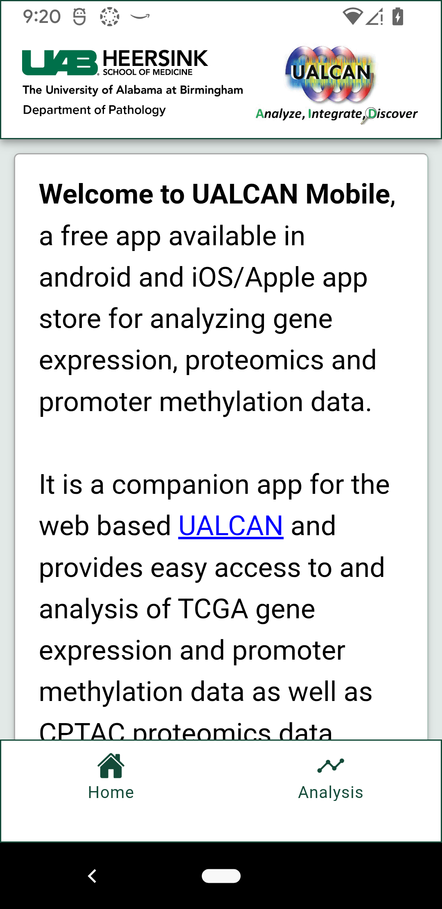
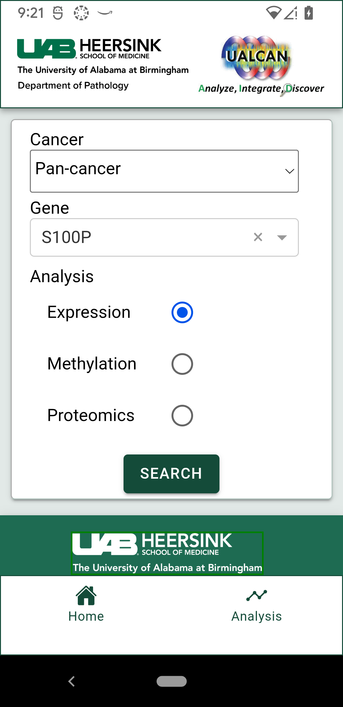
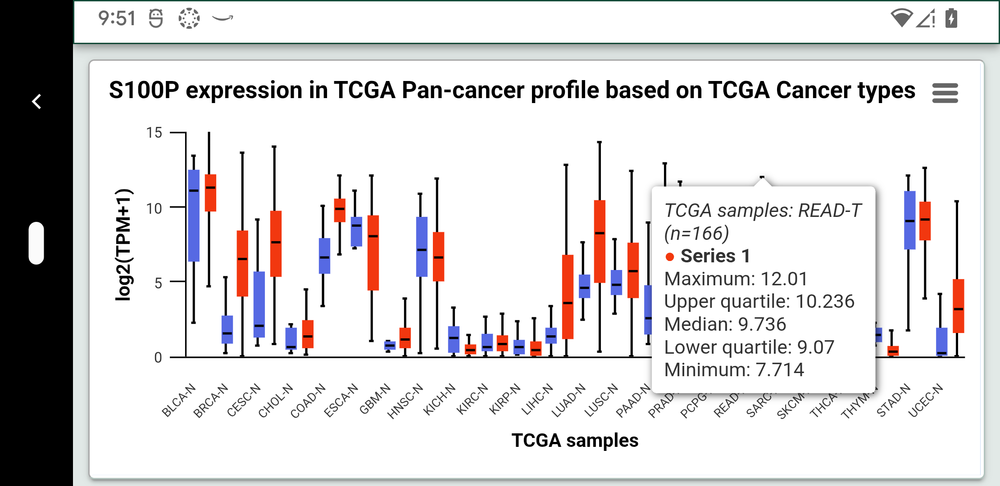
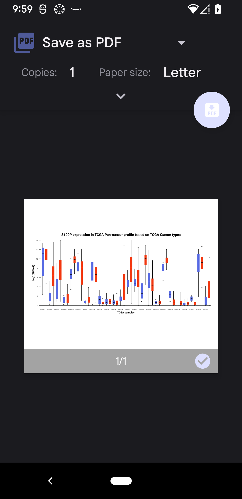

# UALCAN Mobile App

Angular + Ionic + Cordova

App ID: `edu.uab.path.ualcan`

Hybrid mobile application built using **Angular**, **Ionic**, and
**Apache Cordova**. 

Runs on:

-   **Browser** (development testing)
-   **Android** devices/emulators
-   **iOS** devices/simulators (macOS only)

The Angular application builds the web UI, and Cordova packages it into
native mobile applications.

## Screenshots

### Home Screen


### Analysis Screen


### Data Visualization


### PDF Export


## Build Pipeline

In this repo, **Angular builds directly to Cordova's `www/` folder**.

        Angular source
            ↓
         ng build
            ↓
        www/ (Cordova web assets)
            ↓
    cordova run android / ios / browser

**Important:** Run `npm run build` before any `cordova run ...` so you
package the latest web assets.

## Repo Versions

-   Angular: `^21.2.0`
-   Ionic Angular: `^8.7.18`
-   TypeScript: `^5.9.3`
-   Cordova platforms:
    -   `cordova-android`: `^14.0.1`
    -   `cordova-ios`: `^8.0.0`
    -   `cordova-browser`: `^7.0.0`

Android: - `android-minSdkVersion`: **24** -
`android-targetSdkVersion`: **35**


# System Requirements

## Node.js

Install the **Node.js LTS** version.

Verify:

``` bash
node -v
npm -v
```

## Angular CLI (global)

``` bash
npm install -g @angular/cli
ng version
```

## Cordova CLI (global)

``` bash
npm install -g cordova
cordova -v
```

# Android Development Setup

Android builds require **Android Studio**, the **Android SDK**, and a
**Java JDK**.

## Install Android Studio + SDK

Install Android Studio.

In **Android Studio → SDK Manager**, install: 
- Android SDK Platform **API 35** 
- Android SDK **Build-Tools** 
- Android SDK **Platform-Tools** (includes `adb`)

## Install Java JDK

Install **JDK**.

## Environment Variables / PATH

Set: 
- `JAVA_HOME` = path to your JDK 
- `ANDROID_SDK_ROOT` = path to your Android SDK (or `ANDROID_HOME`)

Add to PATH: - `$JAVA_HOME/BIN` 

Verify Java:

``` bash
java -version
javac -version
```

Add to PATH: - `$ANDROID_SDK_ROOT/platform-tools` (so `adb` works)

Verify ADB:

``` bash
adb devices
```

## Gradle

You generally **do not install Gradle manually**.

Cordova Android uses the **Gradle wrapper** inside: -
`platforms/android/gradlew`

The wrapper downloads the required Gradle version automatically during
build.


# iOS Development Setup (macOS Only)

Install **Xcode** from the App Store.

Install command line tools:

``` bash
xcode-select --install
```

Accept license:

``` bash
sudo xcodebuild -license accept
```

Install CocoaPods (commonly required):

``` bash
sudo gem install cocoapods
pod --version
```


# Project Setup

From the project root:

``` bash
npm install
```


# Development Workflow

## 1) Build Angular to `www/`

``` bash
npm run build
```

Watch mode (rebuild on changes):

``` bash
npm run watch
```

## 2) Add Cordova Platforms (first time only / new machine)

``` bash
cordova platform add browser
cordova platform add android
```

macOS only:

``` bash
cordova platform add ios
```

## 3) Run / Test

Browser:

``` bash
cordova run browser
```

Android:

``` bash
cordova run android
cordova run android --device
cordova run android --emulator
```

iOS (macOS only):

``` bash
cordova run ios
cordova run ios --emulator
```


# Clean Rebuild

If builds get out of sync:

``` bash
rm -rf platforms plugins node_modules
npm install

cordova platform add browser
cordova platform add android
# macOS only:
cordova platform add ios

npm run build
cordova run browser
```


# Troubleshooting

## White screen / stale UI

Rebuild Angular (to `www/`) then rerun:

``` bash
npm run build
cordova run android
```

## Android build issues

-   Confirm API 35 installed in SDK Manager
-   Confirm `JAVA_HOME` and `ANDROID_SDK_ROOT` are correct
-   Confirm `adb devices` shows your device/emulator

## iOS build failures (Exit code 65)

Ensure:

-   Confirm Xcode command line tools installed\
-   Confirm Xcode license accepted

Open the project inside:

platforms/ios

and build directly in Xcode to inspect the detailed error